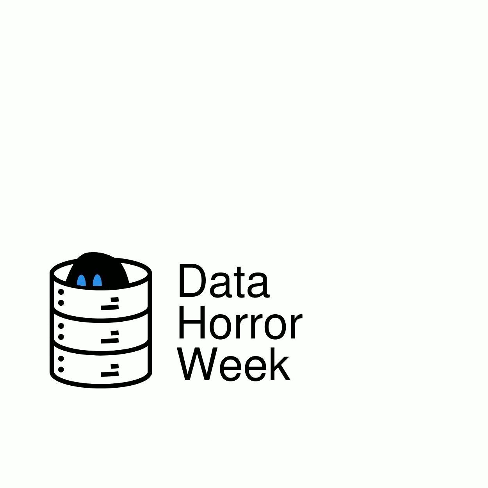
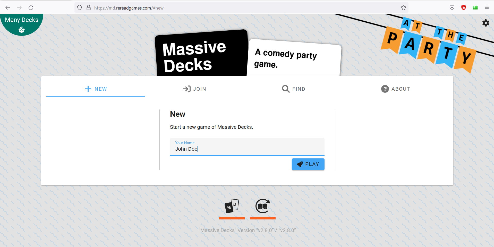
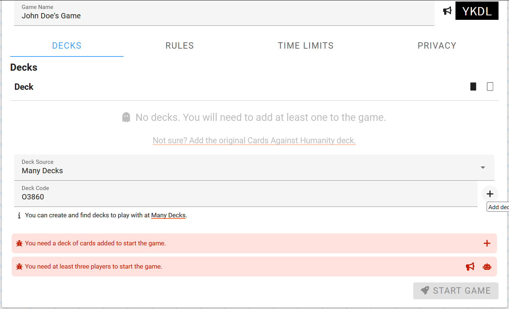
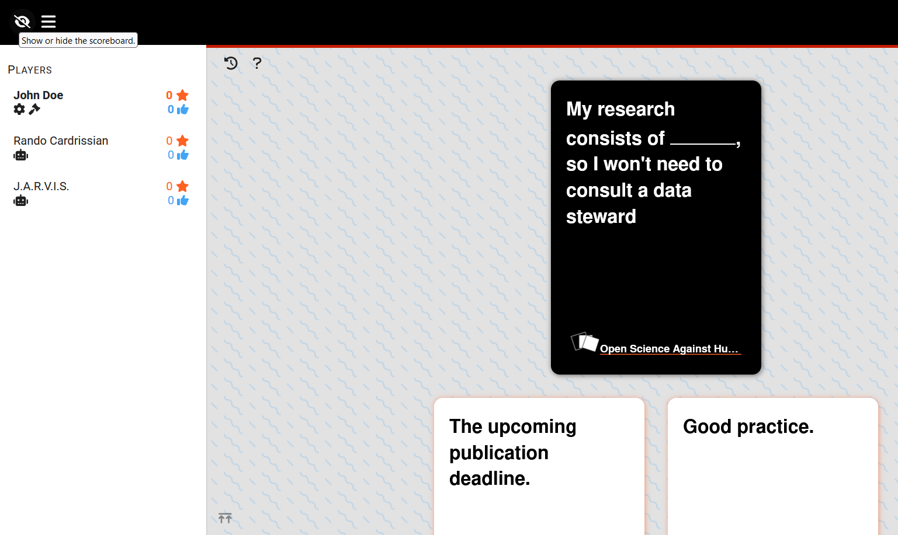

[](https://doi.org/10.5281/zenodo.10017280)



# Open Science Against Humanity

**Welcome to the Second Edition of "Open Science Against Humanity"!**

Yes, the title is ironic. This game is all about exploring **Open Science** in a fun, interactive way—celebrating its incredible potential (*for* humanity) while also unpacking its challenges and pitfalls. Our goal is to spark curiosity, foster learning, all to make the research game more [**FAIR**](https://www.go-fair.org/fair-principles/).
Are you ready to play, learn, and laugh your way through the world of **Open Science**?🙌

Open Science Against Humanity is based on Cards Against Humanity, which was released under a [Creative Commons BY-NC-SA 2.0 license](https://creativecommons.org/licenses/by-nc-sa/2.0/).

The [NL-RSE](https://nl-rse.org/)-logo was originally created by [@ctwhome](https://www.ctwhome.com) and licensed under XXX. We made some adjustments to the original logo to make it blend better with the aesthetic of the overall game.

The code for generating the cards is licensed under the [Apache 2.0 license](https://www.apache.org/licenses/LICENSE-2.0).

This game can be played in person or online. If you are interested in the printed game, please [reach out](rdm@vu.nl) to us!

## Goal of the Game

The goal of the game is to pair the white cards (prompts) and the black cards in the funniest, most provocative, or smartest way you can.

## How to Play

This game can be played with the physical cards and online. To learn how to play the game online, check out [this section](#playing-online).

🧍3+ players		⏰ 5 minutes - 24 hours	🏋️ difficulty level: researcher friendly

Shuffle the deck of white cards and deal four to each player. Leave the rest of the white cards and black cards separated into face-down stacks. Determine a Reviewer: The person who is the most notorious procrastinator when it comes to publishing.

The Reviewer reveals the first black card. They read it out aloud and leave it face up on the table. Each other player chooses a white response card from their hand that fits best to the revealed black card and places it face down on the table. After every player has played a card, the Reviewer shuffles and then reveals all played white cards and reads out loud how they complete the prompt on the black card. The Reviewer picks the smartest, funniest and/or the card they like the most. You can also discuss all options as a group and collect votes to determine a winning card. The player with the winning card will receive 3 citation points to their h-index.
Discard all played white cards in a discard pile and discard the black card back to the box. Draw new white cards until every player has 4 white cards in their hand.

Optional bonus points: After each round, when all the white cards have been revealed, each player is allowed to tell a funny, horrifying or otherwise entertaining story or fact from their own experience that matches one of the black and white card combinations on the table. Depending on how much laughter, pity or knowledge gain is spread among the group, the Reviewer may award up to 5 additional citation points to that player.

The role of the Reviewer is passed on clockwise after every turn. Play until there are no more black cards outside the box. If you run out of white cards, shuffle the discard pile and draw from those. Whoever has the most citation points at the end of the game wins!

## Playing online

You can play the game with the "Open Science Against Humanity" deck <a href="https://md.rereadgames.com/" target="_blank">here</a> on Massive Decks.

One player needs to start the game and invite the others. To do so, fill in one name and click on "Play".



In the "Deck Source" dropdown menu select **Many Decks** and for the deck code use the one below.

```
O3860
```

Next click on the "+" to add the deck. You will receive a game code that you can share with fellow players. They can join the game by going to:

```
https://md.rereadgames.com/games/[game code]
```

Note that optional adjustments in the rules and time limits are possible if you have specific preferences.



Next click on the :loudspeaker: to invite 2 or 3 other players to the game.
Once they join, you can start the game!

When you start playing, the rules described in the section above "How to play" apply.

Note that when playing online, you can't actually "see" whether someone played a card, is thinking. Or who is the Reviewer and who is playing (if you are reviewing, you can't play a card!). If you are confused about what is happening, press the "?" at the top of the game window. The game will tell you what your role is and what you are supposed to do. If you are playing and have selected a card, do not forget to press the check mark at the bottom right of the screen to send the card to the pile of played cards.

If you click on the top left "Show or hide the scoreboard", you can see the status and roles during each round. But also, don't forget to keep talking to each other :game_die: :ghost: :smiley: :game_die:



## Acknowledgements

Watch closely 🕵️‍♀️ All cards that have the NL-RSE logo on it were thought of by the community during a session on the [National Research Software Day 2024](https://www.esciencecenter.nl/national-research-software-day-2024/).


This game was created by the **GHOST Collective**, Games of Horror for Open Science Training. You can find a continuously updates list of all our contributors [on our website](https://ghostcollective.github.io/).

Previous GHOST collective games can be found [here](https://ghostcollective.github.io/games.html). These include physical and online card games as well as online escape rooms.

*Made with ♥ and Open Science*
